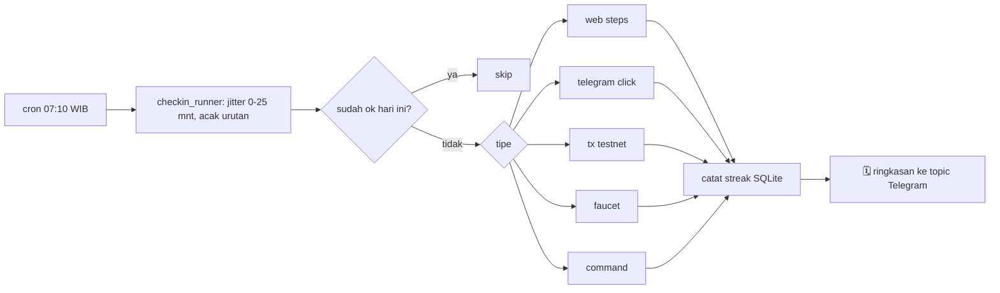

# 05 · Daily check-in

```mermaid
flowchart LR
  A[cron 07:10 WIB] --> B[checkin_runner: jitter 0-25 mnt, acak urutan]
  B --> C{sudah ok hari ini?}
  C -- ya --> N[skip]
  C -- tidak --> D{tipe}
  D --> W[web steps] & T[telegram click] & X[tx testnet] & F[faucet] & M[command]
  W & T & X & F & M --> S[catat streak SQLite]
  S --> R[🗓️ ringkasan ke topic Telegram]
```
- Tambah blok `checkin:` per project. Uji `checkin_runner.py --dry-run`.
- Selector rusak → debug `web_quest.py run --steps ... --headed` lewat VNC.
