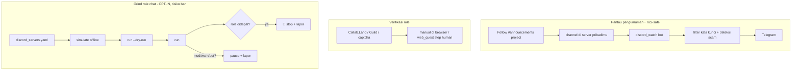

# 06 · Discord

```mermaid
flowchart TD
  subgraph Pantau [Pantau pengumuman · ToS-safe]
    A[Follow #announcements project] --> B[channel di server pribadimu] --> C[discord_watch bot] --> D[filter kata kunci + deteksi scam] --> E[Telegram]
  end
  subgraph Role [Verifikasi role]
    F[Collab.Land / Guild / captcha] --> G[manual di browser / web_quest step human]
  end
  subgraph Grind [Grind role chat · OPT-IN, risiko ban]
    H[discord_servers.yaml] --> I[simulate offline] --> J[run --dry-run] --> K[run] --> L{role didapat?}
    L -- ya --> M[🏅 stop + lapor]
    K -- mod/warn/bot? --> P[pause + lapor]
  end
```
- Detail grinding: `../discord-role-grind.md`.
- Jangan pernah klik link dari DM "support/mod".
